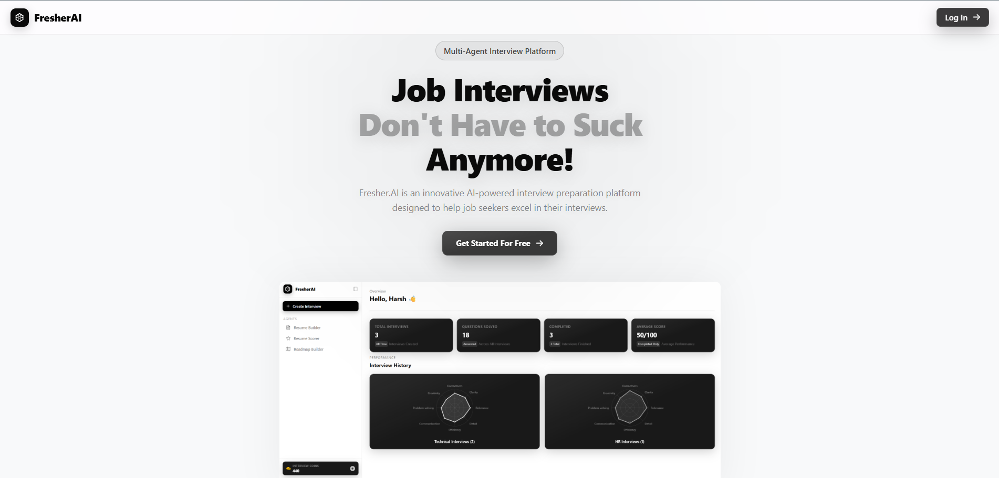
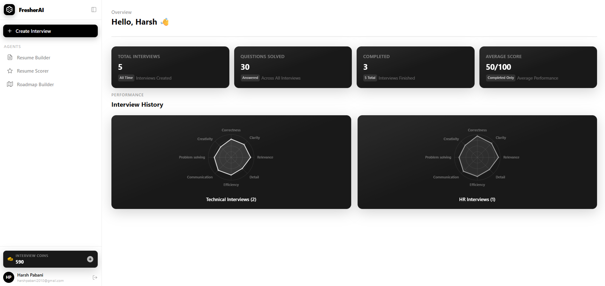
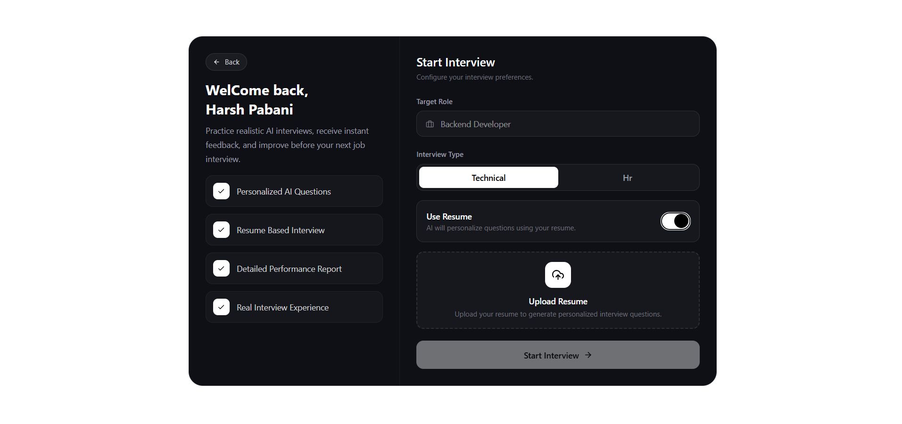
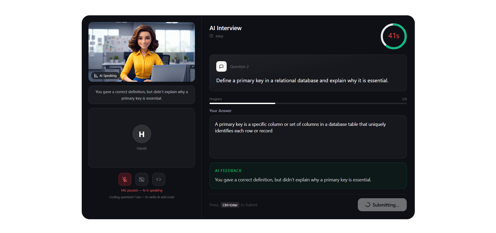
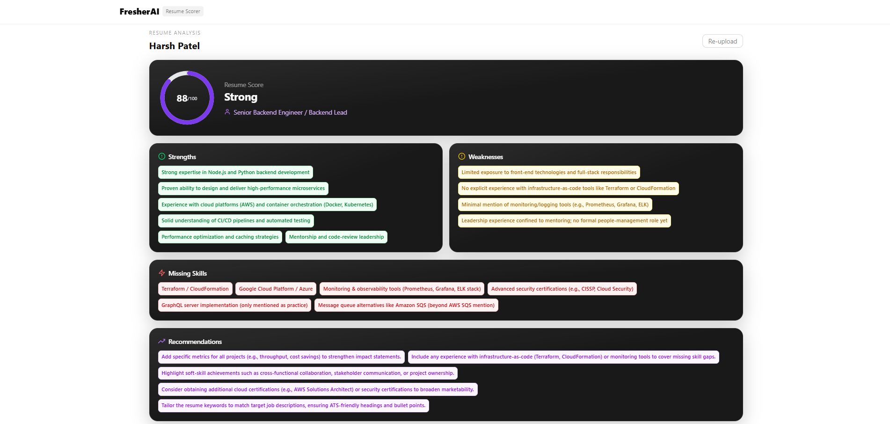
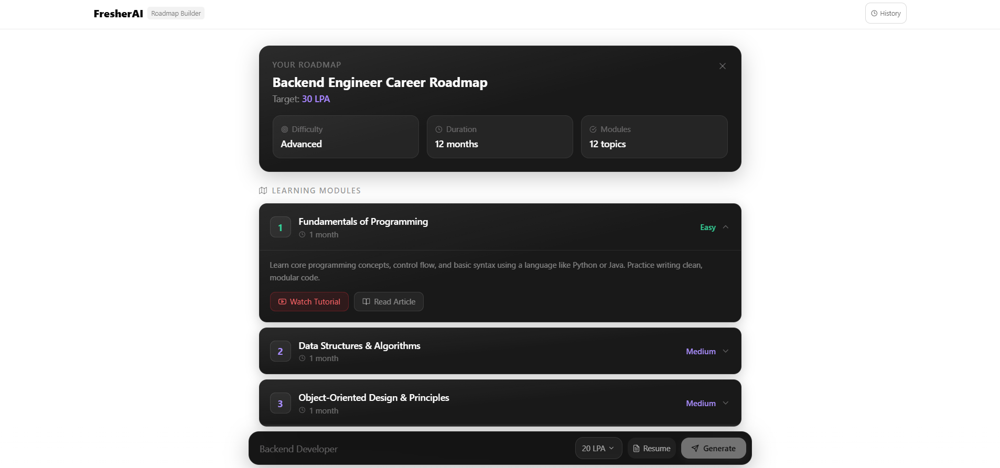
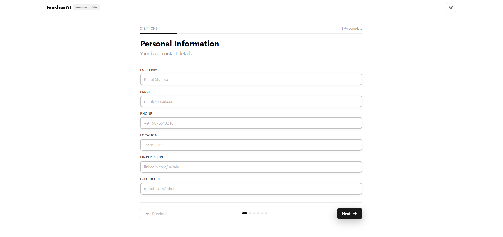
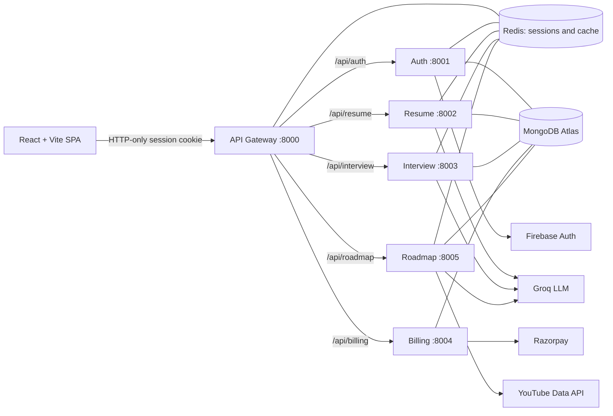
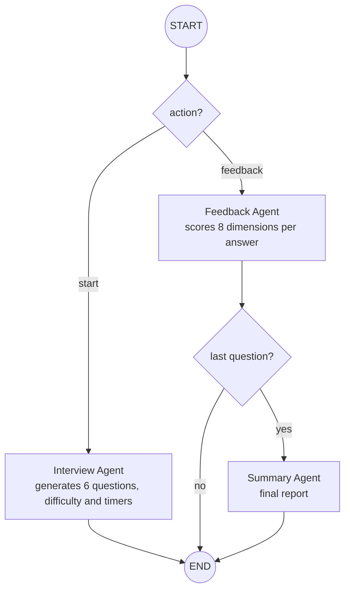
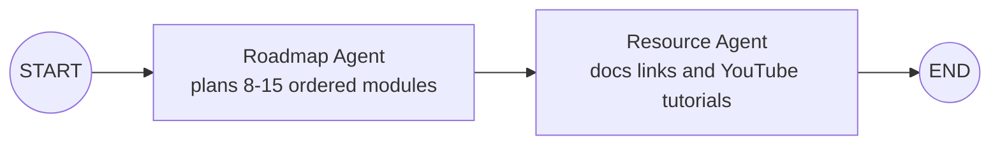

# FresherAI

**A multi-agent AI interview preparation platform.** Practice realistic technical and HR interviews with an AI interviewer, get instant per-answer feedback and a detailed performance report, then score your resume, build one, and generate a personalised learning roadmap for your target role and salary.

<!-- > Live demo: _add your deployed URL here_ -->

---

## Table of Contents

- [Features](#features)
- [Screenshots](#screenshots)
- [Architecture](#architecture)
- [AI Agent Workflows](#ai-agent-workflows)
- [Tech Stack](#tech-stack)
- [Project Structure](#project-structure)
- [Getting Started](#getting-started)
- [Environment Variables](#environment-variables)
- [API Overview](#api-overview)
- [Coin System and Payments](#coin-system-and-payments)
- [Security Design](#security-design)
- [Known Limitations](#known-limitations)
- [Roadmap](#roadmap)
- [Author](#author)

---

## Features

### 1. AI Interview
- Choose a **target role** (any role, e.g. Backend Developer) and an **interview type**: Technical or HR.
- Optionally **personalise questions from your resume** (skills, projects, weaknesses, missing skills).
- The AI generates **6 questions** with escalating difficulty (easy / medium / hard) and a **per-question timer** matched to the question's complexity.
- **Live interview room**
  - AI interviewer avatar that speaks each question aloud (browser text-to-speech)
  - Answer by **typing or by voice** (Web Speech API); the mic pauses automatically while the AI speaks
  - Optional camera self-view (nothing is recorded or uploaded)
  - Countdown timer with **auto-submit** when time runs out
  - Built-in **Monaco code editor** for coding questions: JavaScript, TypeScript, Python, Java, C++
- Every answer is scored by a Feedback agent on **8 dimensions**: correctness, clarity, relevance, detail, efficiency, communication, problem solving and creativity, plus short interviewer-style feedback and 3 improvements.
- After the last question a Summary agent produces a **final report**: overall score, summary, strengths, weaknesses and recommendations. Download it as **PDF**.
- **Dashboard**: total interviews, questions answered, completed interviews, average score, and radar charts of your skill profile, split by Technical and HR.

### 2. Resume Scorer
Upload a PDF resume and get an ATS-style **score out of 100**, strengths, weaknesses, missing skills, a suggested role and actionable recommendations. The parsed resume is reused to personalise interviews and roadmaps.

### 3. Resume Builder
A 6-step guided form (personal info, summary, skills, experience, projects, education) with a **live ATS-friendly preview** and PDF download. Runs fully in the browser.

### 4. Roadmap Builder
Pick a role, a target package (10–40 LPA) and optionally attach your resume. Get a module-by-module learning path (8–15 modules) with difficulty, duration, a documentation/article link and a YouTube tutorial for every module. Past roadmaps are saved in a history drawer.

### 5. Coin System
New users get **150 free Interview Coins**. Each AI feature spends coins, and more can be purchased through **Razorpay** (test mode).

---

## Screenshots

> Add your own screenshots to `docs/screenshots/` (use demo data, not real personal resumes).

### Landing Page


| Dashboard | Interview Setup |
|---|---|
|  |  |

| Live Interview | Resume Scorer |
|---|---|
|  |  |

| Roadmap Builder | Resume Builder |
|---|---|
|  |  |


---
## Architecture

FresherAI uses a **microservices backend** behind a single API gateway. The gateway authenticates every request against a Redis-backed session and forwards the verified user identity to the services.



**Request flow**

1. The user signs in with Firebase on the frontend; the ID token is sent to `/api/auth/login`.
2. The Auth service verifies the token with `firebase-admin`, creates or loads the user, stores a session in Redis (`session:{id}`, 7-day TTL) and sets an **HTTP-only, secure** cookie.
3. For every protected route the gateway's `isAuth` middleware reads the cookie, looks the session up in Redis, and forwards the request with a trusted `x-user-id` header.
4. Downstream services never handle tokens; they only trust the identity attached by the gateway.

**Redis is used for**
- Session storage (`session:{sessionId}`)
- Read-through caching of the dashboard (`interviews:{userId}`), the parsed resume (`resume:{userId}`) and roadmaps (`roadmap:{userId}:{id}`, `userRoadmaps:{userId}`), invalidated on writes and expired with TTLs

---

## AI Agent Workflows

All LLM calls use **Groq** (`openai/gpt-oss-120b`) through LangChain. Workflows are orchestrated with **LangGraph** `StateGraph`s that share typed state between agents.

### Interview service: 3 agents with conditional routing



- **Interview Agent** picks a technical or HR prompt, personalises it from the resume when provided, and returns JSON questions. Software roles get coding questions; non-coding roles get practical scenario questions.
- **Feedback Agent** evaluates one answer and returns scores, a short conversational comment and three improvements.
- **Summary Agent** consumes every question, answer and feedback to produce the overall score, strengths, weaknesses and recommendations.

### Roadmap service: 2 agents in a pipeline



- **Roadmap Agent** skips topics the resume shows the user already knows and focuses on gaps for the target role and package.
- **Resource Agent** attaches an article link per module and searches the **YouTube Data API** for a matching tutorial.

### Resume service: 1 analysis agent
PDF → text extraction (`pdf-parse`) → **Resume Agent** → structured JSON (score, strengths, weaknesses, missing skills, suggested role, recommendations) stored per user.

> Coding answers are reviewed by the Feedback agent for correctness and approach. They are **not executed** in a sandbox.

---

## Tech Stack

| Layer | Technologies |
|---|---|
| Frontend | React 19, Vite, Redux Toolkit, React Router, Tailwind CSS 4, Motion, Recharts, Monaco Editor, react-to-print, Axios |
| Backend | Node.js, Express 5, `express-http-proxy`, Multer, `pdf-parse` |
| AI | LangGraph, LangChain, Groq (`openai/gpt-oss-120b`) |
| Data | MongoDB Atlas (Mongoose), Redis (ioredis) |
| Auth | Firebase Authentication, Redis-backed sessions with HTTP-only cookies |
| Payments | Razorpay (test mode) |
| External APIs | YouTube Data API v3 |
| DevOps | Docker, Docker Compose |
| Browser APIs | Web Speech API (recognition and synthesis), `getUserMedia` |

<!-- --- -->

<!-- ## Project Structure

```
fresherAI/
├── backend/
│   ├── gateway/                 # API gateway: auth middleware, proxying
│   │   ├── controllers/
│   │   ├── middleware/          # isAuth (Redis session check)
│   │   └── utils/               # proxyWithHeaders (x-user-id propagation)
│   ├── services/
│   │   ├── auth/                # Firebase verify, users, sessions, coins
│   │   ├── billing/             # Razorpay orders and verification
│   │   ├── interview/           # LangGraph: interview, feedback, summary agents
│   │   │   ├── agents/  graph/  prompts/  models/  controllers/  routes/
│   │   ├── resume/              # PDF upload, parsing, resume agent
│   │   └── roadmap/             # LangGraph: roadmap and resource agents
│   ├── shared/redis/            # shared Redis client
│   └── docker-compose.yml
└── frontend/
    └── src/
        ├── apis/  utils/  redux/
        ├── components/          # interview/, resume/, roadmap/, shared UI
        └── pages/               # Dashboard, InterviewStart, InterviewPage,
                                 # InterviewReport, Scorer, ResumeBuilder,
                                 # Roadmap, Billing
``` -->

---

<!-- ## Getting Started

### Prerequisites
- Node.js 22+
- Docker and Docker Compose
- A MongoDB Atlas cluster
- API keys: Groq, YouTube Data API, Razorpay (test), and a Firebase project with a service account

### 1. Clone

```bash
git clone <your-repo-url>
cd fresherAI
```

### 2. Configure environment
Create a `.env` file in each of `backend/gateway` and `backend/services/{auth,resume,interview,roadmap,billing}` and in `frontend`. See [Environment Variables](#environment-variables).

### 3. Run the backend with Docker

```bash
cd backend
docker compose up --build
```

The gateway is exposed on `http://localhost:8000`. The individual services and Redis stay on the internal Docker network.

### 4. Run the frontend

```bash
cd frontend
npm install
npm run dev
```

### Run a service without Docker
Start a local Redis, then in a service folder run `npm install && npm run dev`. Set `REDIS_URL` and the service URLs to `localhost` ports.

---

## Environment Variables

Names only. **Never commit real values or the Firebase service account file.**

**Gateway**

| Variable | Purpose |
|---|---|
| `PORT` | Gateway port (8000) |
| `FRONTEND_URL` | Allowed CORS origin |
| `REDIS_URL` | Redis connection string |
| `AUTH_SERVICE_URL`, `RESUME_SERVICE_URL`, `INTERVIEW_SERVICE_URL`, `ROADMAP_SERVICE_URL`, `BILLING_SERVICE_URL` | Internal service URLs |
| `INTERNAL_KEY` | Shared secret the gateway sends to services |

**Services**

| Variable | Used by |
|---|---|
| `PORT`, `REDIS_URL`, `MONGODB_URL`, `INTERNAL_KEY` | all services |
| `FIREBASE_SERVICE_ACCOUNT` | auth |
| `GROQ_API_KEY` | interview, resume, roadmap |
| `YOUTUBE_API_KEY` | roadmap |
| `RAZORPAY_KEY_ID`, `RAZORPAY_KEY_SECRET` | billing |

**Frontend**

| Variable | Purpose |
|---|---|
| `VITE_BACKEND_URL` | Gateway URL |
| `VITE_FIREBASE_APIKEY` | Firebase web API key |
| `VITE_RAZORPAY_KEY_ID` | Razorpay public key |

---

## API Overview

All routes go through the gateway. Everything except `/api/auth/login`, `/api/auth/logout` and `/api/warmup` requires a valid session cookie.

| Method | Route | Description |
|---|---|---|
| POST | `/api/auth/login` | Verify Firebase ID token, create session |
| POST | `/api/auth/logout` | Destroy session |
| GET | `/api/me` | Current user and coin balance |
| POST | `/api/resume/upload` | Upload PDF, analyse, store |
| GET | `/api/resume/get-resume` | Fetch stored analysis |
| POST | `/api/interview/start` | Generate questions, start interview |
| POST | `/api/interview/answer` | Submit answer, get feedback (and final report on last question) |
| GET | `/api/interview/all` | Dashboard stats and radar data |
| GET | `/api/interview/:id` | Fetch one interview |
| POST | `/api/roadmap/generate` | Generate a roadmap |
| GET | `/api/roadmap/all` | Roadmap history |
| GET | `/api/roadmap/:id` | Fetch one roadmap |
| POST | `/api/billing/create` | Create Razorpay order |
| POST | `/api/billing/verify` | Verify payment signature and credit coins |
| GET | `/api/warmup` | Wake sleeping services on free hosting |

Coin deduction and crediting are **internal service operations**, not public endpoints.

--- -->

## Coin System and Payments

| Action | Cost |
|---|---|
| AI Interview | 50 coins |
| Roadmap Generator | 20 coins |
| Resume Scorer | 10 coins |
| Resume Builder PDF download | 10 coins (client-side) |

- New accounts start with **150 free coins**.
- **Starter plan:** ₹199 for 300 coins (Razorpay test mode).
- Coins are deducted **on the server, atomically, before an AI workflow runs**, using a conditional MongoDB update (`balance >= cost`), and refunded if the workflow fails. This prevents overspending under concurrent requests.
- Plans and prices are defined **server-side**; the client only chooses a plan ID.
- Payments are verified with **HMAC-SHA256 signature checks**. Coins are credited by the Billing service in the same step that moves an order from `created` to `paid`, so a replayed request cannot credit twice.
- The Resume Builder is fully client-side, so its PDF-download charge is a soft, client-side limit.

---

## Security Design

- Firebase ID tokens are verified server-side with `firebase-admin`.
- Sessions live in Redis, so logout and revocation take effect immediately.
- Session cookie is `httpOnly` and `secure`; JavaScript cannot read it.
- The gateway attaches `x-user-id`, and services accept requests only with a valid `INTERNAL_KEY`.
- Every read and write is scoped by `userId`, including cache keys.
- Uploaded PDFs are deleted from disk after processing and stored under unique filenames.
- Only the gateway is published in Docker; Redis and services are not exposed on the host.

---

## Known Limitations

- **Voice input** uses the browser Web Speech API, which works in Chrome and Edge only. Typing always works.
- The AI avatar is a looping video that plays while the browser voice speaks; it is **not lip-synced**.
- Coding answers are **reviewed by the LLM, not executed**.
- Payments run in **Razorpay test mode**.
- On free hosting, services can take up to a minute to wake; the frontend retries and the gateway exposes `/api/warmup`.
- LLM output can occasionally be malformed JSON or contain imperfect links; learning links are AI-curated and not guaranteed to be live.

---

## Roadmap

- [ ] Razorpay webhooks (`payment.captured`) so paid orders always credit coins
- [ ] Schema validation (Zod) and automatic retry for LLM JSON output
- [ ] Sandboxed code execution with test cases for coding questions
- [ ] Server-side question timers that survive page refresh
- [ ] Rate limiting and `helmet` on the gateway
- [ ] Queue (e.g. BullMQ) and streaming for long LLM calls
- [ ] More resume templates

---

## Author

**Harsh Pabani**
[LinkedIn](https://www.linkedin.com/in/harsh-pabani-7a8337247/) · [GitHub](https://github.com/harsh201045)